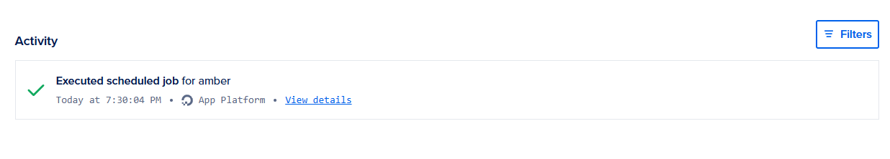
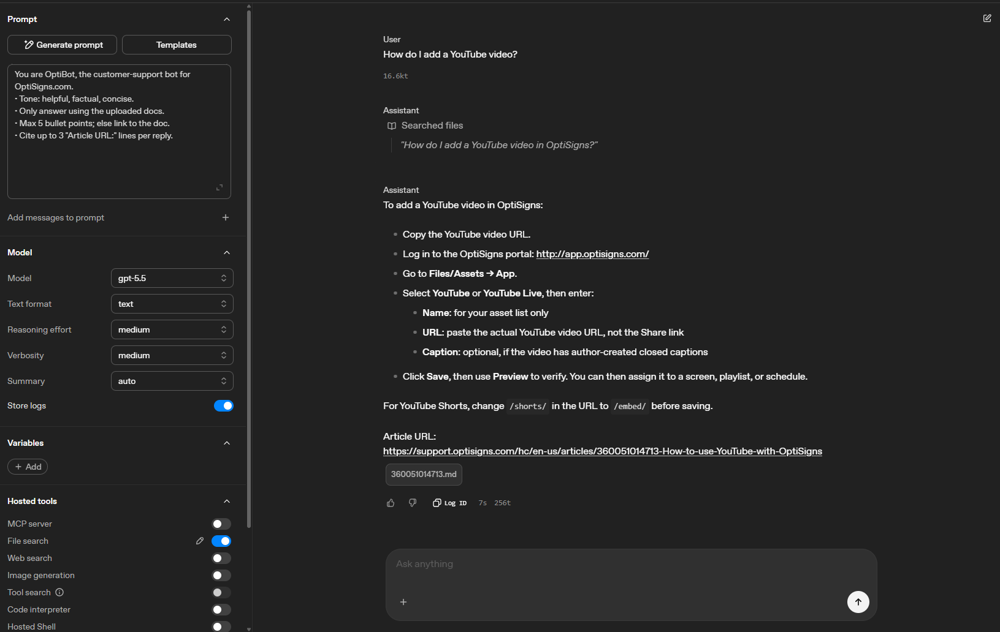

# amber

A Python application that synchronizes public Zendesk Help Center articles to an OpenAI Vector Store. The job detects new or updated articles and uploads only the delta.

## Features

- Scrape public Zendesk Help Center articles
- Detect new and updated articles
- Upload only changed articles to OpenAI
- Replace outdated files in the Vector Store
- Dockerized for scheduled execution
- Designed to run once per day

## Setup

### 1. Clone the repository
### 2. Create `.env`

Copy `.env.sample` to `.env`.

```env
OPENAI_API_KEY=your_api_key
VECTOR_STORE_ID=your_vector_store_id
BASE_URL=https://support.optisigns.com
```

### 3. Install dependencies

```bash
pip install -r requirements.txt
```

## Run Locally

```bash
python main.py
```

## Run with Docker

Build the image:

```bash
docker build -t zendesk-sync .
```

Run the job:

```bash
docker run --rm --env-file .env zendesk-sync
```

The container runs the synchronization once and exits with status code `0`.

## Daily Scheduled Job

The Docker image is deployed as a scheduled job on DigitalOcean App Platform and runs once per day.

Daily job logs:

[View on DigitalOcean](https://cloud.digitalocean.com/apps/15ebb431-df9e-4da7-b49f-c743a00005a1/jobs/)


## Playground

The synchronized knowledge base was tested in the OpenAI Playground.

Screenshot:

